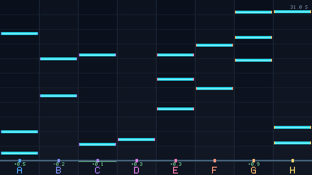

# CHERS

Demo:https://youtu.be/eflUBbF9UCc?si=nKCc1GDSP96oHJAo

**화면만 보고 타이밍에 맞게 버튼을 치는 Linux 리듬 벤치마크.** 음악 없이 2–16개의
레인과 불규칙한 하드웨어 난수 채보로 시각 인식·예측·입력 타이밍을 측정합니다.
벤치와 외부 에이전트는 별도 프로세스이며, 연결 라이브러리는 화면 픽셀과
A–P 타격 인터페이스를 제공합니다.

CHERS is a **visual-only real-time rhythm benchmark** built in C++20. An
external agent observes complete images, predicts when notes reach the judgement
line, and sends individual lane taps. The rules are public and there is no audio.
This repository includes the engine, a C client library, an independent result
verifier, and a deterministic pixel diagnostic player.

## Demo



The demonstration uses **8 lanes and 20 total note-generation attempts per
second**. Its player is the separate deterministic pixel diagnostic client;
the Cursor/Codex view shows the coding session, not an LLM executing the timing
loop. The recorded run is a fresh hardware-entropy chart.

The YouTube upload will be added here by the project owner. The local 16:9
video and subtitle files are kept outside the source repository. See
[video details](docs/VIDEO.md).

<!-- After uploading, replace the poster above with:
[](ACTUAL_YOUTUBE_URL)
Use the published video URL; no upload is implied by this placeholder.
-->

## Build and run

Requires Linux, an x86 CPU with RDSEED, C++20, CMake, Ninja, pkg-config and SDL3
(3.2 or later). Python 3 runs the verifier and Python-based test groups.

```sh
cmake -S . -B build -G Ninja -DCMAKE_BUILD_TYPE=Release
cmake --build build
ctest --test-dir build --output-on-failure
./build/chers 8 20
```

There are exactly two workload arguments:

| Argument | Meaning |
| --- | --- |
| `LANES` | Integer 2–16, left to right A–P |
| `DENSITY` | Total average attempts/s, between `2*LANES` and `24*LANES` |

Space/Enter starts. A–P taps. Escape or closing the window aborts an unfinished
run and preserves diagnostic results. Holding a key may produce OS repeat
events, and every received keydown is a tap. A completed window stays open to
show results. No audio device is initialized.

## Fixed rules

- Hardware RDSEED drives exponential random attempt intervals. Choose an
  unlocked lane uniformly; drop attempts when every lane is locked. Minimum
  target spacing on each lane: **40 ms**. No hidden CSPRNG fallback.
- One-second visual preview; **5 seconds calibration, 5 seconds wait, 50 seconds
  scored play**. Initial preview and both 20 ms final judgement allowances make
  the complete session 61.040 seconds after Start.
- Perfect: **±8 ms, +2**. GOOD: **through ±20 ms, +1**.
- Empty tap: **−5** and **+100 ms to delaySum**. Miss: zero, still in denominator.
- A hit consumes its note immediately. Every subsequent tap is judged anew.
- `score = (2*Perfect + GOOD - 5*empty) / (2*actual_trial_notes)`.
- `delaySum_ms = absolute_successful_hit_errors_ms + 100*empty`.
- The result displays `DELAYSUM … MS (AVERAGE … MS)`. AVERAGE is the mean
  absolute timing error of successful hits, rounded to three decimal places;
  it excludes empty-tap penalties and is N/A when there are no successful hits.
- Calibration and trial are separate. Negative scores are valid; no-note scores
  are N/A. See [agent.md](agent.md) for exact interval boundaries.

## External agents: pixels in, taps out

Build produces `libchers_client.so`. Include
[`chers/client.h`](include/chers/client.h), or use the Python ctypes
example in [`examples/python_client.py`](examples/python_client.py).
The C example is [`examples/client.c`](examples/client.c).

1. Connect to the endpoint printed by the benchmark.
2. Read complete **640×360 RGBA8** frames. Equal lanes fill the entire frame.
3. Start the session, then send individual zero-based lane taps.
4. Learn constant delay using the calibration feedback drawn on screen.

The observation stream targets **80 fps / 12.5 ms**; actual publication gaps
over the **16 ms goal** are measured. Human rendering uses an independent
1280×720 texture and a separate refresh loop. Neither a slow display nor a slow
frame consumer is allowed to dictate input timing. Intermediate video frames may
be skipped by clients; input events may not be silently dropped.

The connection is a Unix sequenced-packet socket plus read-only shared frame
memory. The library copies a leased, completed frame into caller storage before
releasing it. No chart, game-clock timestamp, note IDs, coordinates or scores
are present in the transport metadata. The image shows moving notes, phase
labels and hit feedback. No continuously increasing game clock is displayed.
This is a protocol/process boundary, not a hostile-same-user security sandbox.
The full interface contract is in [agent.md](agent.md); threading, transport and
timing details are in [the architecture notes](docs/ARCHITECTURE.md).

## Results and replay

After completion or abort, `runs/TIMESTAMP-PID/` contains:

- `result.json`: both metrics, counts, generation statistics, validity, timing
  compliance and system/build information.
- `notes.csv`, `inputs.csv`: private chart and timestamped input records released
  only after the run, for independent replay.
- `timing_samples.csv`: publication, renderer and polling duration samples.
- `final.ppm`: the completed model-view result image (on normal completion).

```sh
python tools/verify_run.py runs/TIMESTAMP-PID
python tools/verify_run.py runs/TIMESTAMP-PID --require-timing
```

`valid` concerns complete, lossless scoring. `timing_compliant` independently
reports whether all measured model publication gaps met 16 ms. Report both;
a correct score alone does not establish timing compliance. Sanitizer builds
are for correctness, not performance claims.

## Operational settings

These environment settings control process operation, not workload difficulty:

| Setting | Purpose |
| --- | --- |
| `CHERS_SOCKET` | Alternate Unix endpoint for isolated concurrent tests |
| `CHERS_OUTPUT` | Result directory root, default `runs` |
| `CHERS_HEADLESS=1` | Omit human SDL window, keep identical model renderer |
| `CHERS_AUTOSTART=1` | Start without keyboard/client control |
| `CHERS_EXIT_AFTER_RUN=1` | Exit 0.5 s after saving completed results |

The previous `CHRONOLANE_` environment names and `chronolane/client.h` header
remain compatibility aliases. Use the CHERS names for new integrations.
The build directory also forwards `chronolane` and `libchronolane_client.so`
to the current CHERS binaries, so earlier local commands use the updated UI.

Only one model client connects at a time. CPU affinity for input and model-frame
workers is applied within the process when at least four CPUs are available;
chosen CPUs and actual timings are recorded. No kernel/desktop power settings
are changed. The application never shuts down the computer.

## Verification

```sh
cmake -S . -B build-asan -G Ninja -DCMAKE_BUILD_TYPE=Debug -DCHERS_SANITIZE=ON
cmake --build build-asan
ctest --test-dir build-asan --output-on-failure
```

The diagnostic pixel player is written from scratch and sees only public
rendered images. It is an interface/control baseline, not a trained neural model
or a claim about an LLM's real-time inference speed. Final local verification
evidence is documented in [VERIFICATION.md](VERIFICATION.md), including fresh
50-second trials, independent replay, timing measurements and retained failures.

To reproduce a fresh pixel-only trial, run the benchmark in one terminal and the
diagnostic in another. The second process starts the session through the public
ABI and discovers note timing from pixel trajectories and its own frame-receipt
clock, with no saved chart, seed or displayed game clock.

```sh
CHERS_EXIT_AFTER_RUN=1 ./build/chers 16 384
./build/pixel_agent 16 - evidence/agents/my-fresh-trial pixel
```

The optional final diagnostic mode can be `blind40ms` (fixed-period tapping
without reading note positions) or `idle` (no taps). These modes help establish
what the two metrics mean; they never change the benchmark's scoring rules.

## License

CHERS is released under **The Unlicense**. See [UNLICENSE](UNLICENSE) for the
complete text, sourced from [unlicense.org](https://unlicense.org/).
External dependencies retain their own licenses.
