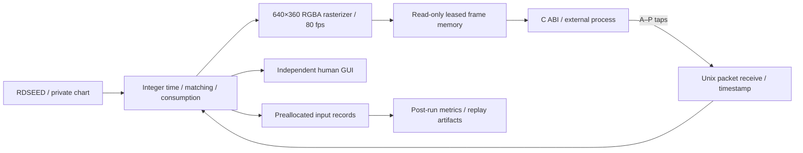

# CHERS architecture and measurement boundaries

## Timing

The input worker uses `CLOCK_MONOTONIC` and absolute sleeps, targeting a 1 ms
polling period. Inputs are timestamped at server reception, before matching or
rendering. Human SDL keydowns enter a bounded queue and are timestamped when the
input worker accepts them; this human path must not be confused with the model
socket's reception boundary. Neither path accepts caller-supplied timestamps.

The core retains integer nanoseconds. Milliseconds in the image and JSON are a
display unit, not a quantization of the judgement clock. Absolute deadlines
avoid cumulative relative-sleep drift; they do not eliminate scheduler latency.
Actual polling intervals, render/publication cost and publication intervals are
stored independently. See [Linux clock_nanosleep](https://man7.org/linux/man-pages/man2/clock_nanosleep.2.html).

Rendering and input run on separate workers. When enough CPUs are available,
each worker requests a different CPU from the process's allowed affinity mask.
This is process-local affinity, not exclusive CPU ownership or a real-time
kernel guarantee. The model renderer copies only currently visible unconsumed
notes under the core lock, then rasterizes outside it. Binary search avoids
scanning the entire future chart each frame.

Human rendering uses SDL3 on the main thread, a streaming texture and a separate
refresh deadline. Model frames never come from screenshots of this human
window. They are the canonical renderer's exact completed 360p pixels. The human
window can change size without changing the model task.

## Frame transport

The Unix `SOCK_SEQPACKET` connection preserves individual action messages. A
read-only sealed `memfd` contains three pixel slots; it contains no private game
state. A reader requests a frame newer than its previous sequence and leases
one complete slot. The publisher rotates through the remaining slots while the
reader copies its leased image. Release ends the lease. A stalled reader cannot
hold all slots. A second active model connection is rejected.

The frame mapping cannot be resized or newly mapped writable by the client.
Leases prevent torn-frame reads through the documented API. Producer and
consumer still share a physical computer; same-UID/root hostile process
inspection is outside this protocol's isolation guarantee. See
[mmap](https://man7.org/linux/man-pages/man2/mmap.2.html) and
[Unix domain sockets](https://man7.org/linux/man-pages/man7/unix.7.html).

640×360 RGBA at 80 fps is 73.728 MB/s of raw pixel content per copy. The API
deliberately provides uncompressed pixels; no video codec or screenshot-file
round trip belongs on the inference path. The client owns a stable copied frame
and may pool, crop, downsample or otherwise process that frame itself.

## Judgement and deferred work

Each lane has an ordered list and cursor. An input advances past consumed or
expired notes, matches the earliest eligible note, consumes it, and appends one
record. The next input is evaluated independently. There is no tap debounce or
input cooldown. Out-of-range protocol actions, backwards timestamps, excessive
input drain or exhausted event storage invalidate the run explicitly.

The core does not calculate aggregate scores per frame. Final aggregation sums
recorded events after the trial, including 100 ms per empty tap in delaySum.
The result's inline average uses only the absolute errors of successful hits,
divided by the number of those hits. It excludes empty-tap penalties, rounds to
three decimal places in the display and is N/A when there are no successful hits.
Time subtraction and absolute value are small operations; preserving consistent
work and avoiding allocation/file I/O on the input worker matters more than
removing this arithmetic. The independent verifier reconstructs matching from
raw lane/time inputs, without trusting the claimed note IDs or judgements.

No-note and invalid outcomes display N/A. Invalid completed trials retain
diagnostic records but cannot be published as valid benchmark results. Validity
freezes when the trial completes, so a later client error cannot retroactively
disagree with the already saved result.

## Diagnostic client

`pixel_agent` is a separately compiled deterministic visual control baseline.
It uses the public client API, reads phase labels and calibration feedback with
bitmap OCR. After observing WAIT, it recognizes scored play from the absent
phase label and intact lane/judgement pixels; inference is recorded separately
from direct OCR. It tracks note trajectories against its own monotonic frame-receipt
clock to schedule future taps. No global game clock is displayed or exported.
It never reads the private chart, input results, process memory, or hidden origin
timestamp. The CHERS client library is `libchers_client.so`; its public C header
is `chers/client.h`.

The client buffers observation records and six screenshot images in RAM during
play; disk writes occur after the scheduling thread stops. This follows a real
observed failure: a synchronous diagnostic screenshot once delayed that
consumer by 127 ms even though the benchmark kept publishing on time. The
original record is retained in the verification evidence.

Model publication intervals and external frame receipt intervals are different
measurements. A slow agent may skip frames while the benchmark continues. Report
both where available. No result here claims a frontier LLM performed the
millisecond control loop itself; this baseline validates the benchmark and its
model integration path.

The human renderer recreates its texture at the actual window pixel size when
resized, preserving glyph and lane geometry in side-by-side recordings. The
model renderer remains fixed at 640×360.
